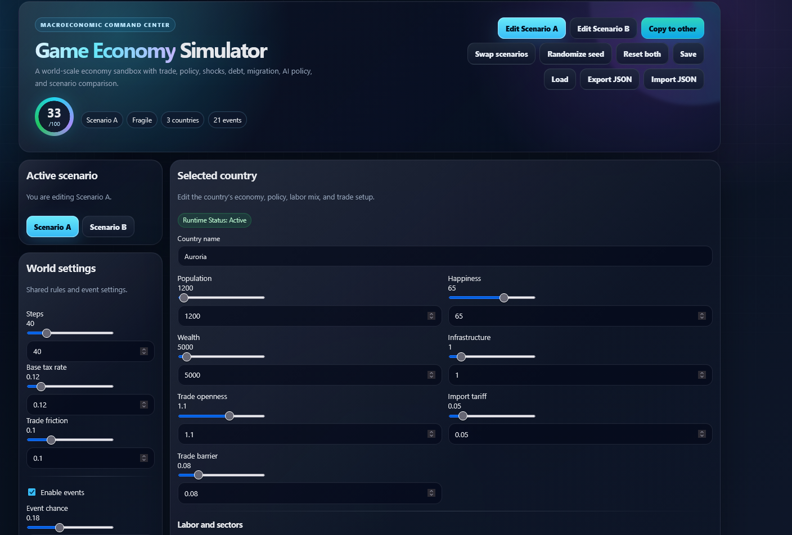
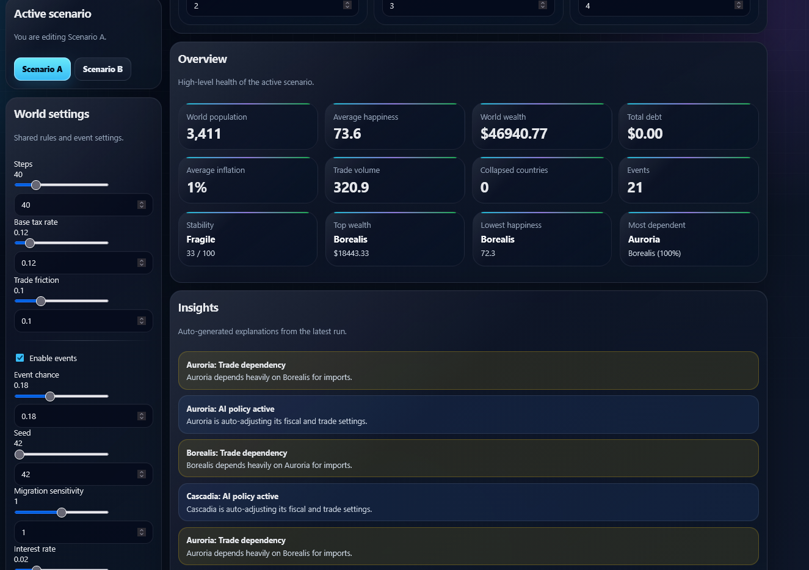
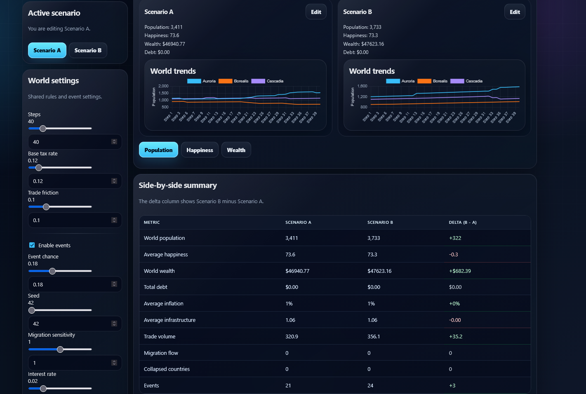

# World Economy Simulator

Interactive multi-country economic simulation featuring trade networks, AI-driven policy decisions, stochastic economic events, and real-time analytics.

## Features

* Multi-country economic modeling
* Bilateral trade networks with dependency tracking
* AI policy agents that adjust taxes, subsidies, and investments
* Inflation, migration, GDP, debt, and happiness simulation
* Seeded random event system for economic crises and booms
* Real-time economic visualizations
* Automated policy recommendations
* Save/load scenarios
* JSON import/export
* Interactive dashboard UI

## Screenshots

### Global Economic Dashboard







See [docs/ARCHITECTURE.md](docs/ARCHITECTURE.md)

## Tech Stack

* TypeScript
* React
* Vite
* Chart.js

## Installation

```bash
npm install
npm run dev
```

## Build

```bash
npm run build
```

## Future Improvements

* Machine-learning-based policy agents
* Currency exchange markets
* Banking and monetary policy systems
* Population demographics
* Resource and energy sectors
* Multiplayer economic competition